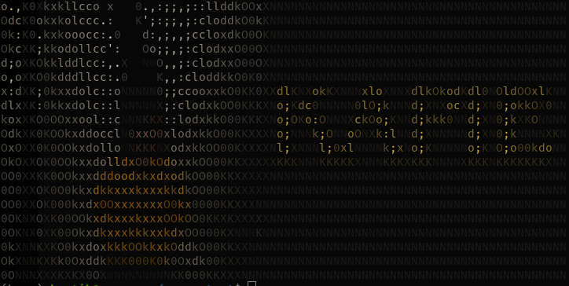

# Text Expander
<div align="center">
  
</div>
This Python script provides a simple text expansion functionality, allowing you to quickly insert predefined text snippets using custom shortcuts.

## Features

- Easy-to-use text expansion
- Customizable snippets
- Non-intrusive operation using hotkeys
- Clipboard-safe implementation

## Requirements

- Python 3.x
- `keyboard` library
- `pyperclip` library

## Installation

1. Clone this repository or download the script.
2. Install the required libraries:

```
pip install keyboard pyperclip
```

## Usage

1. Define your snippets in the `snippets` dictionary at the beginning of the script.
2. Run the script:

```
python text_expander.py
```

3. The text expander will start running. To use it:
   - Type a defined shortcut (e.g., "addr")
   - Press Ctrl+Space
   - The shortcut will be replaced with its corresponding text

4. To stop the script, press the ESC key.

## Customizing Snippets

Edit the `snippets` dictionary in the script to add, remove, or modify text expansions:

```python
snippets = {
    "addr": "123 Main St, Springfield, USA",
    "email": "your.email@example.com",
    "sig": "Best regards,\nYour Name"
}
```

## How It Works

- The script uses the `keyboard` library to listen for the Ctrl+Space hotkey.
- When triggered, it checks if the last typed word matches any defined snippets.
- If a match is found, the script replaces the shortcut with the corresponding expanded text.
- The implementation is clipboard-safe, preserving the original clipboard content.

## Limitations

- The script must be run with administrator privileges due to its use of keyboard hooks.
- It may interfere with other applications that use the Ctrl+Space hotkey.

## Contributing

Contributions, issues, and feature requests are welcome. Feel free to check [issues page](https://github.com/yourusername/text-expander/issues) if you want to contribute.

## License

[MIT](https://choosealicense.com/licenses/mit/)
